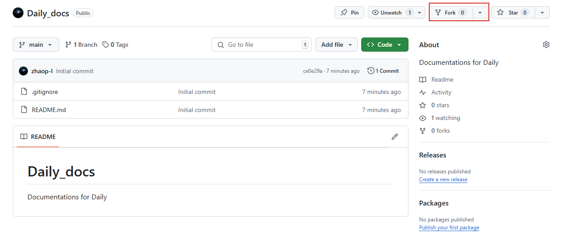

# 文档贡献指南

## 一、修改前的准备工作

### 1.1 Fork

先跳转到 [zhaop-l/Daily_docs](https://github.com/zhaop-l/Daily_docs) GitHub 首页，然后单击 Fork 按钮，生成自己仓库下的目录，比如你的 GitHub 用户名为 USERNAME，则生成： https://github.com/USERNAME/Daily_docs。



### 1.2 Clone
将你目录下的远程仓库 clone 到本地。
```bash
➜ git clone https://github.com/USERNAME/Daily_docs.git
➜ cd Daily_docs
```

### 1.3 创建本地分支

使用 `git checkout -b` 创建并切换到新分支。

```
➜  git checkout -b my-cool-stuff
```
值得注意的是，在 `checkout` 之前，需要保持当前分支目录 clean，否则会把 untracked 的文件也带到新分支上，这可以通过 `git status` 查看。

## 二、提交 & push

### 2.1 提交

- 修改并提交文件

```bash
➜  git status
➜  git add .
```

- commit ：提交本地更改

每次 `git commit` 都需要写提交说明，方便其他人了解每次提交做了哪些改变，可以通过 `git commit -m <commit_message>` 完成。

```bash
➜  git commit -m "fix docs bugs"
```

### 2.2 确保本地仓库是最新的

在准备发起 Pull Request 之前，需要同步[原仓库](https://github.com/zhaop-l/Daily_docs)最新的代码。

首先通过 `git remote` 查看当前远程仓库的名字。

```bash
➜  git remote
➜  git remote -v
➜  git remote add upstream https://github.com/zhaop-l/Daily_docs.git
➜  git remote
```

获取 upstream 的最新代码并更新当前分支。
```bash
➜  git fetch upstream
➜  git pull upstream main
```

### 2.3 Push 到远程仓库

将本地的修改推送到 GitHub 上

```bash
# 推送到远程仓库 origin 的 my-cool-stuff 分支上
➜  git push origin my-cool-stuff
```

## 三、提交 PR

在你 push 后在对应仓库会提醒你进行 PR 操作，点击后，按格式填写 PR 内容，即可。